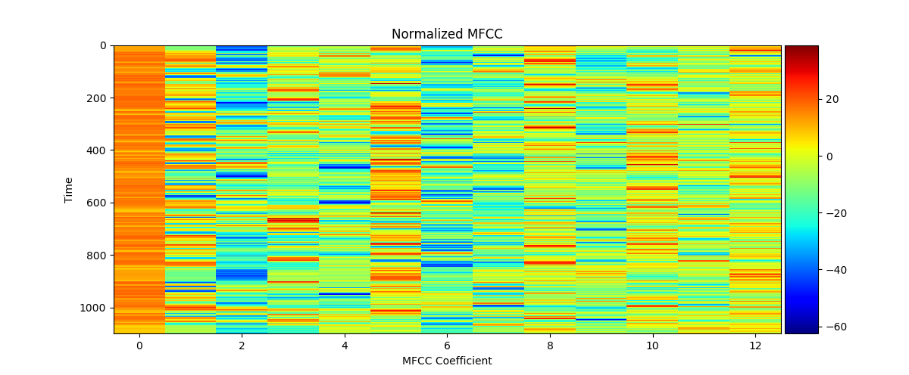

## Mel Frequency Cepstral Coefficients (MFCC)
[MFCC](http://practicalcryptography.com/miscellaneous/machine-learning/guide-mel-frequency-cepstral-coefficients-mfccs/) feature extraction is complicated to explain, but easy to implement with available libraries.

In this short quiz, you'll write a function that converts a `.wav` file to MFCC features.  You'll need a way to extract the signal from the wave file and then a method
to convert the signal to MFCC.  Here are the resources you need to write your function:

* [scipy.io.wavfile.read](https://docs.scipy.org/doc/scipy-0.14.0/reference/generated/scipy.io.wavfile.read.html) (to extract the signal)
* [python_speech_features.mfcc](http://python-speech-features.readthedocs.io/en/latest/) (to convert to MFCC)

When you succeed in returning the correct file, you will "see" the MFCC spectrum in the output similar to the following:

